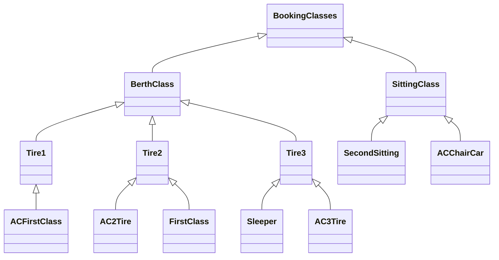
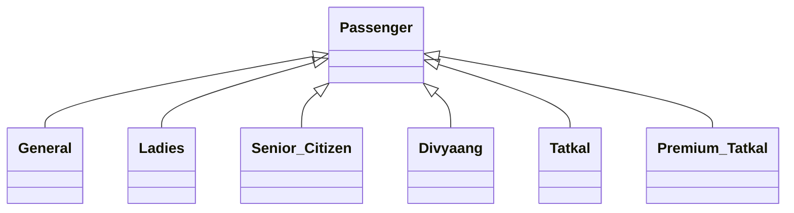

# Ticket Booking System

## Railway.cpp, Railway.h

Railway class contains two static vectors sStations and sDistStation and It can calculate distance between any two given stations and Railway is a singleton class as there can be only one railway with name IndianRailways.

 

## BookingClasses.cpp, BookingClasses.h

It Contains 4 abstract classes BookingClasses, Tire1, Tire2, Tire3  and rest are Singleton classes representing options given by Indian Railway because for all instance of any one type all factors must be same.

​																								Diagram 1

## Passenger.cpp, Passenger.h

IT contains one abstract class Passenger and hierarchy is formed based on category of passenger as represented in Diagram 2

​																									Diagram 2

## Date.cpp, Date.h

Date Class contains two static vectors containing month names and 3 unsigned integers representing day, month and year.

## Station.cpp, Station.h

Contains Station class, It only contains name attribute of every station

## Booking.cpp, Booking.h

It contains Booking class, It takes all other classes like passenger, Date, Station as input and calculate fair for a given booking.

## Applcation.cpp

It contains all Unit Test cases and all Application test cases both given and Written.

## Abhishek Gandhi | 19CS10031